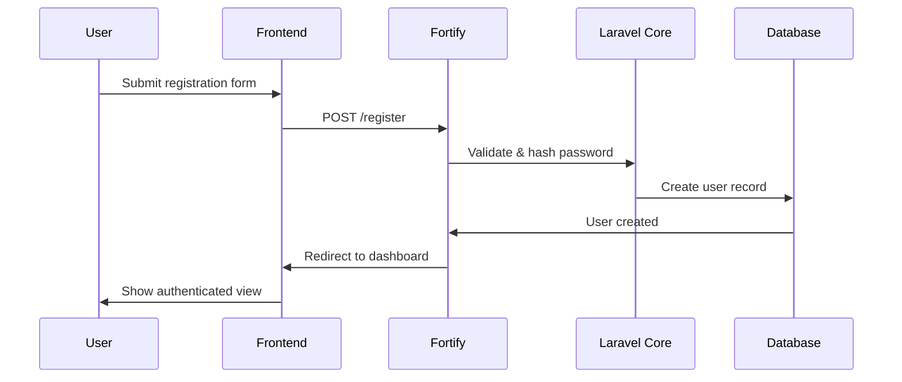
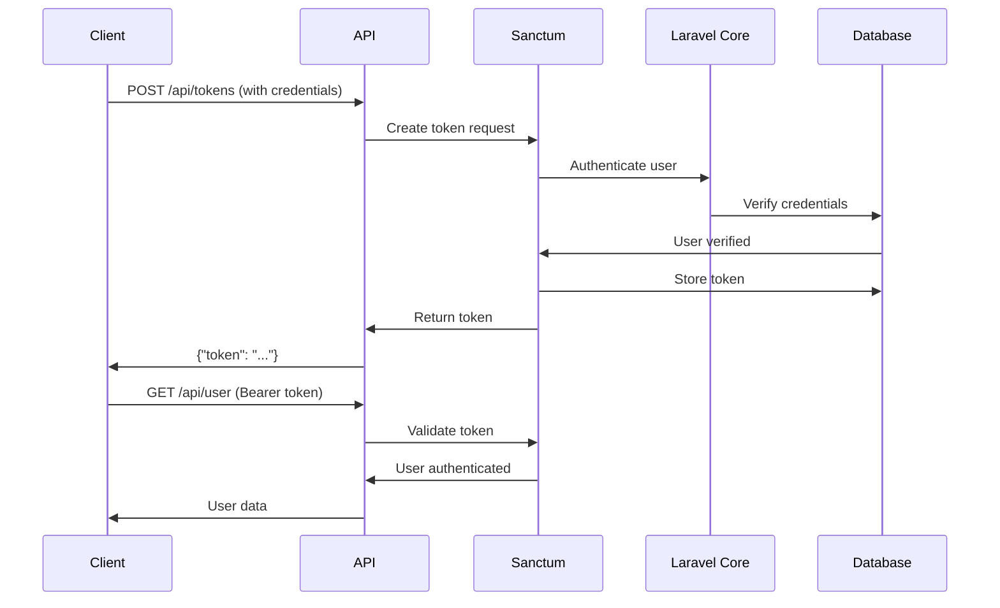
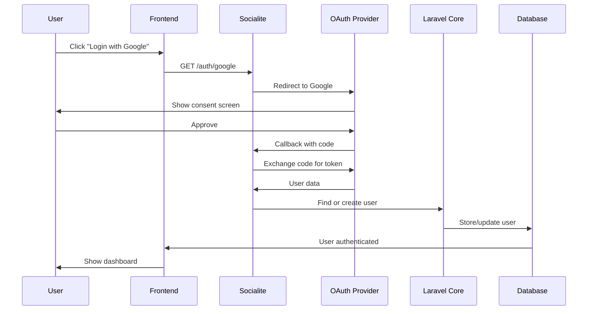

# Authentication Architecture

## 🚨 **IMPORTANT: Start Here First**

**BEFORE reading this guide, you MUST complete the [Development Workflow](Development-Workflow) consistency check.**

This ensures you understand the authentication system within the context of the overall system architecture and patterns.

## Overview

This document provides a comprehensive overview of the authentication system architecture in the Thorium90 Multi-Role User Authentication system, detailing when and where each component (Laravel 12 Core, Fortify, Sanctum, and Socialite) is used.

## Table of Contents

1. [Architecture Overview](#architecture-overview)
2. [Component Responsibilities](#component-responsibilities)
3. [Authentication Flow](#authentication-flow)
4. [Component Integration](#component-integration)
5. [Decision Guide](#decision-guide)
6. [Code Examples](#code-examples)
7. [Best Practices](#best-practices)

## Architecture Overview

The authentication system is built on a layered architecture where each component has specific responsibilities:

```
┌─────────────────────────────────────────────────────────────────┐
│                        Frontend (React + Inertia.js)             │
├─────────────────────────────────────────────────────────────────┤
│                     Authentication Middleware Layer              │
│  ┌─────────────┐  ┌─────────────┐  ┌─────────────┐            │
│  │   Fortify    │  │   Sanctum   │  │  Socialite  │            │
│  │  (Headless)  │  │ (API/SPA)   │  │   (OAuth)   │            │
│  └─────────────┘  └─────────────┘  └─────────────┘            │
├─────────────────────────────────────────────────────────────────┤
│                    Laravel 12 Core Authentication                │
│              (Sessions, Guards, Providers, Middleware)           │
├─────────────────────────────────────────────────────────────────┤
│                  Spatie Laravel Permission                       │
│              (Roles, Permissions, Authorization)                 │
├─────────────────────────────────────────────────────────────────┤
│                         Database Layer                           │
│        (Users, Roles, Permissions, Tokens, Social Logins)       │
└─────────────────────────────────────────────────────────────────┘
```

## Component Responsibilities

### Laravel 12 Core Authentication

**Purpose**: Foundation for all authentication features

**Responsibilities**:
- Session management and cookies
- Authentication guards and providers
- Base middleware system (`auth`, `guest`, etc.)
- Password hashing and validation
- Remember me functionality
- Authentication events and listeners

**When to Use**:
- Always active as the foundation
- Direct use for custom authentication logic
- Extending authentication functionality

**Key Files**:
- `config/auth.php` - Authentication configuration
- `app/Models/User.php` - User model
- `bootstrap/app.php` - Middleware registration

### Laravel Fortify

**Purpose**: Headless authentication backend implementation

**Responsibilities**:
- User registration with role assignment
- Login/logout functionality
- Two-factor authentication (2FA)
- Email verification (enhanced)
- Password reset and recovery
- Password confirmation for sensitive actions
- Profile information updates

**When to Use**:
- All user registration flows
- Password management operations
- 2FA setup and verification
- Email verification processes
- Profile updates

**Key Files**:
- `config/fortify.php` - Fortify configuration
- `app/Actions/Fortify/*` - Custom Fortify actions
- `app/Http/Controllers/Auth/TwoFactorChallengeController.php` - 2FA handling

### Laravel Sanctum

**Purpose**: API authentication and SPA session management

**Responsibilities**:
- Personal access token generation
- API token authentication
- SPA cookie-based authentication
- Token abilities/scopes
- Token revocation
- CSRF protection for SPAs

**When to Use**:
- Mobile app authentication
- Third-party API access
- SPA authentication (React frontend)
- Machine-to-machine authentication
- Microservices communication

**Key Files**:
- `config/sanctum.php` - Sanctum configuration
- `routes/api.php` - API routes
- Database: `personal_access_tokens` table

### Laravel Socialite

**Purpose**: OAuth/social login integration

**Responsibilities**:
- OAuth provider integration (Google, GitHub, Facebook, etc.)
- Social user data retrieval
- Account linking with existing users
- Avatar synchronization
- OAuth state management

**When to Use**:
- Social login buttons
- OAuth provider authentication
- Third-party identity verification
- Simplified registration process

**Key Files**:
- `config/services.php` - OAuth provider configuration
- `app/Http/Controllers/Auth/SocialLoginController.php` - Social login handling
- Database: `provider` and `provider_id` columns in users table

### Spatie Laravel Permission

**Purpose**: Role-based access control (RBAC)

**Responsibilities**:
- Role management
- Permission management
- Role-permission relationships
- User role assignment
- Permission checking
- Middleware for route protection

**When to Use**:
- All authorization decisions
- Route protection based on roles/permissions
- UI element visibility control
- API endpoint access control

**Key Files**:
- `config/permission.php` - Permission configuration
- `database/seeders/RoleSeeder.php` - Role definitions
- `app/Http/Middleware/EnsureUserHasRole.php` - Role middleware

## Authentication Flow

### 1. Standard Registration/Login Flow



### 2. API Authentication Flow



### 3. Social Login Flow



## Component Integration

### Fortify + Sanctum Integration

```php
// User registers via Fortify, then creates API token via Sanctum
public function register(Request $request)
{
    // Fortify handles registration
    $user = User::create([
        'name' => $request->name,
        'email' => $request->email,
        'password' => Hash::make($request->password),
    ]);
    
    // Assign default role (Spatie Permission)
    $user->assignRole('Subscriber');
    
    // Create Sanctum token for immediate API access
    $token = $user->createToken('auth-token')->plainTextToken;
    
    return response()->json([
        'user' => $user,
        'token' => $token
    ]);
}
```

### Socialite + Fortify Integration

```php
// Social login creates user, respecting Fortify's user creation rules
public function handleProviderCallback($provider)
{
    $socialUser = Socialite::driver($provider)->user();
    
    // Use Fortify's CreateNewUser action for consistency
    $user = User::firstOrCreate(
        ['email' => $socialUser->email],
        [
            'name' => $socialUser->name,
            'provider' => $provider,
            'provider_id' => $socialUser->id,
            'avatar' => $socialUser->avatar,
            'email_verified_at' => now(), // Social users are pre-verified
        ]
    );
    
    // Fortify's login process
    Auth::login($user);
    
    // Trigger Fortify's login events
    event(new Login('web', $user, false));
    
    return redirect()->intended('/dashboard');
}
```

### All Components Working Together

```php
// Example: API endpoint that checks social user's 2FA status
Route::middleware(['auth:sanctum'])->get('/api/security-status', function (Request $request) {
    $user = $request->user();
    
    return response()->json([
        // Laravel Core
        'authenticated' => true,
        'session_active' => Auth::check(),
        
        // Fortify
        'email_verified' => $user->hasVerifiedEmail(),
        'two_factor_enabled' => $user->two_factor_enabled,
        'two_factor_confirmed' => $user->two_factor_confirmed,
        
        // Socialite
        'is_social_user' => !empty($user->provider),
        'social_provider' => $user->provider,
        
        // Sanctum
        'current_token_id' => $request->user()->currentAccessToken()->id,
        'token_abilities' => $request->user()->currentAccessToken()->abilities,
        
        // Spatie Permission
        'roles' => $user->getRoleNames(),
        'permissions' => $user->getAllPermissions()->pluck('name'),
    ]);
});
```

## Decision Guide

### When to Use Each Component

#### Use Laravel Core Authentication When:
- Building custom authentication logic
- Implementing custom guards or providers
- Handling authentication events
- Managing sessions directly

#### Use Fortify When:
- Implementing user registration
- Adding 2FA to your application
- Handling password resets
- Managing email verification
- Updating user profiles

#### Use Sanctum When:
- Building a mobile app
- Creating a public API
- Implementing SPA authentication
- Generating API tokens
- Managing token permissions

#### Use Socialite When:
- Adding "Login with Google/Facebook/etc"
- Simplifying user registration
- Integrating with OAuth providers
- Importing user data from social platforms

### Authentication Method Selection

```php
// Decision tree for authentication method
function determineAuthMethod($request)
{
    // API request with Bearer token -> Sanctum
    if ($request->bearerToken()) {
        return 'sanctum';
    }
    
    // API request expecting token auth -> Sanctum
    if ($request->is('api/*')) {
        return 'sanctum';
    }
    
    // OAuth callback -> Socialite
    if ($request->is('auth/*/callback')) {
        return 'socialite';
    }
    
    // 2FA challenge -> Fortify
    if ($request->is('two-factor-challenge')) {
        return 'fortify';
    }
    
    // Standard web request -> Laravel Core + Fortify
    return 'web';
}
```

## Code Examples

### Example 1: Complete User Registration with All Components

```php
// app/Http/Controllers/Auth/RegisterController.php
namespace App\Http\Controllers\Auth;

use App\Models\User;
use Illuminate\Http\Request;
use Illuminate\Support\Facades\Hash;
use Laravel\Fortify\Contracts\CreatesNewUsers;

class RegisterController extends Controller
{
    public function register(Request $request, CreatesNewUsers $creator)
    {
        // 1. Fortify handles validation and user creation
        $user = $creator->create($request->all());
        
        // 2. Spatie Permission assigns default role
        $user->assignRole('Subscriber');
        
        // 3. Laravel Core logs the user in
        Auth::login($user);
        
        // 4. Sanctum creates API token if requested
        if ($request->wantsJson()) {
            $token = $user->createToken('auth-token')->plainTextToken;
            
            return response()->json([
                'user' => $user,
                'token' => $token,
                'two_factor_required' => $user->hasRole(['Admin', 'Super Admin'])
            ]);
        }
        
        // 5. Check if 2FA is required based on role
        if ($user->hasRole(['Admin', 'Super Admin'])) {
            return redirect()->route('two-factor.setup');
        }
        
        return redirect()->intended('/dashboard');
    }
}
```

### Example 2: Protected API Endpoint with Full Auth Stack

```php
// routes/api.php
Route::middleware(['auth:sanctum', 'verified', 'ensure.2fa'])->group(function () {
    Route::get('/admin/users', function (Request $request) {
        // Sanctum validates the token
        // Fortify's 'verified' ensures email is verified
        // Custom 'ensure.2fa' checks 2FA for admin roles
        // Spatie checks permission
        
        if (!$request->user()->can('view users')) {
            abort(403);
        }
        
        return User::with('roles')->paginate();
    });
});
```

### Example 3: Social Login with Role Assignment

```php
// app/Http/Controllers/Auth/SocialLoginController.php
public function handleProviderCallback($provider)
{
    try {
        // 1. Socialite retrieves user data
        $socialUser = Socialite::driver($provider)->user();
        
        // 2. Find or create user
        $user = User::firstOrNew(['email' => $socialUser->email]);
        
        if (!$user->exists) {
            // 3. New user - use Fortify's user creation logic
            $user->fill([
                'name' => $socialUser->name,
                'provider' => $provider,
                'provider_id' => $socialUser->id,
                'avatar' => $socialUser->avatar,
                'email_verified_at' => now(),
            ]);
            $user->save();
            
            // 4. Assign default role
            $user->assignRole('Subscriber');
        } else {
            // Existing user - update social login info
            $user->update([
                'provider' => $provider,
                'provider_id' => $socialUser->id,
                'avatar' => $socialUser->avatar,
            ]);
        }
        
        // 5. Laravel Core authentication
        Auth::login($user, true);
        
        // 6. Check if 2FA is required
        if ($user->hasRole(['Admin', 'Super Admin']) && !$user->two_factor_enabled) {
            session()->flash('message', 'Please enable 2FA for your account security.');
            return redirect()->route('profile.show');
        }
        
        return redirect()->intended('/dashboard');
        
    } catch (\Exception $e) {
        return redirect('/login')->with('error', 'Social login failed.');
    }
}
```

## Best Practices

### 1. Component Isolation

Keep each component focused on its core responsibility:

```php
// ❌ Bad: Mixing concerns
public function login(Request $request)
{
    // Don't handle social login, 2FA, and API tokens in one method
    if ($request->has('provider')) {
        // Social login logic
    } elseif ($request->has('two_factor_code')) {
        // 2FA logic
    } else {
        // Regular login + create API token
    }
}

// ✅ Good: Separate controllers for each auth type
// AuthController.php - Standard login
// SocialLoginController.php - OAuth flows  
// TwoFactorController.php - 2FA challenges
// ApiTokenController.php - Token management
```

### 2. Consistent User Creation

Always use Fortify's actions for user creation:

```php
// ❌ Bad: Direct user creation
$user = User::create($data);

// ✅ Good: Use Fortify action
$user = app(CreateNewUser::class)->create($data);
```

### 3. Role-Based Security

Enforce security requirements based on roles:

```php
// Middleware to enforce 2FA for admin roles
public function handle($request, Closure $next)
{
    $user = $request->user();
    
    if ($user && $user->hasRole(['Admin', 'Super Admin'])) {
        if (!$user->two_factor_enabled || !$user->two_factor_confirmed) {
            return redirect()->route('two-factor.setup')
                ->with('error', '2FA is required for administrator accounts.');
        }
    }
    
    return $next($request);
}
```

### 4. API Security

Always validate token abilities:

```php
// Check token abilities for sensitive operations
if (!$request->user()->tokenCan('admin:write')) {
    abort(403, 'Token does not have required abilities.');
}
```

### 5. Audit Trail

Log authentication events for security:

```php
// Listen to authentication events
Event::listen(Login::class, function ($event) {
    activity()
        ->causedBy($event->user)
        ->withProperties([
            'ip' => request()->ip(),
            'user_agent' => request()->userAgent(),
            'guard' => $event->guard,
        ])
        ->log('User logged in');
});
```

## Testing Considerations

Each component requires specific testing approaches:

### Laravel Core
- Test custom authentication logic
- Verify session handling
- Check remember me functionality

### Fortify
- Test registration with validation
- Verify 2FA flows
- Check password reset process
- Test email verification

### Sanctum
- Test token creation and revocation
- Verify API authentication
- Check token abilities
- Test CSRF protection

### Socialite
- Mock OAuth providers
- Test user creation from social data
- Verify account linking
- Check error handling

### Integration Tests
- Test complete authentication flows
- Verify component interactions
- Check security boundaries
- Test role-based access

## Related Documentation

- [Developer Guide](Developer-Guide.md) - Technical implementation details
- [API Reference](API-Reference.md) - Complete API documentation
- [Testing Strategy](Testing-Strategy.md) - Comprehensive testing guide
- [Troubleshooting](Troubleshooting.md) - Common issues and solutions
